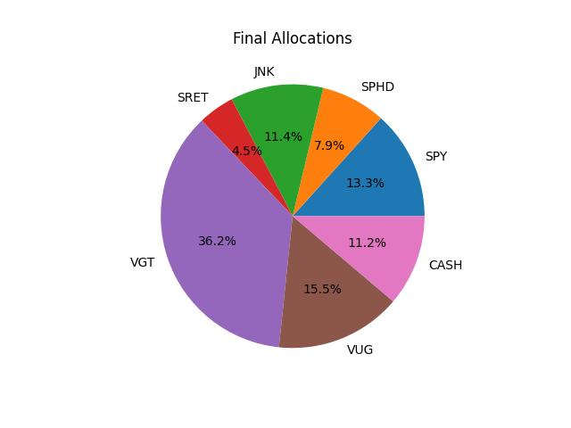
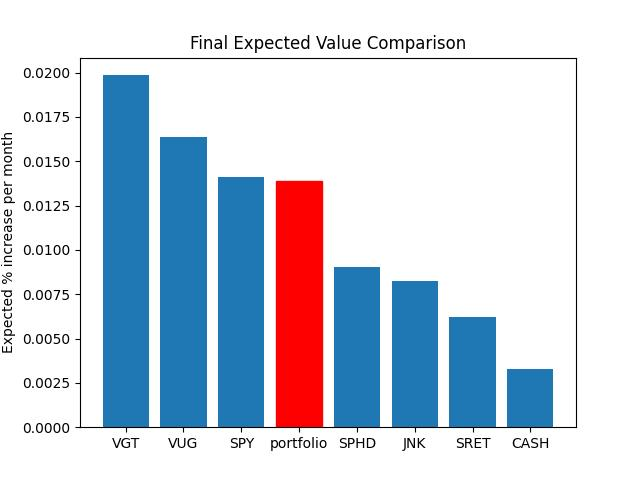
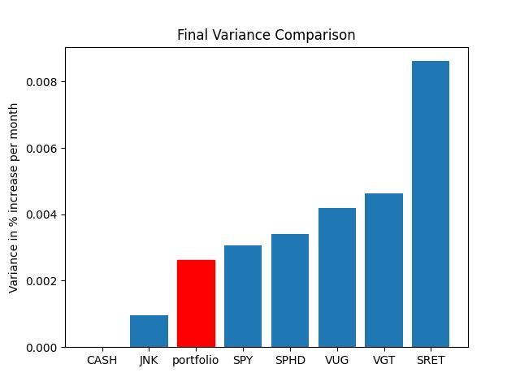

# The Project
This script will give you exploratory analysis and a sample stock portfolio given a configuration file for what you want your portfolio to look like. 

Check [this sample config](sample/config.json) to see what a sample configuration file should look like. Here are the main points
 - tickers: Make sure the format is from Yahoo Finance
 - fixed_rates: label, rate and months(compounding period). This is used to represent fixed-rate assets such as cash accounts
 - losses: defines the losses. Check [process_gd_args.py](pipeline/process_gd_args.py) for some help. Note that 'multiplier' should also be a key if needed

Then, run ```python run_gd_portfolio.py --config-file your_file_here.json``` to run the script.

# Sample Outputs


Sample Portfolio with some index funds and a cash account that pays 4% annually

 

We see that our portfolio has similar expected % increase per month compared to the SPY index fund, with slightly lower variance

# The Math
Given a vector $exp$ of expected change for a list of assets, and a covariance matrix $cov$ and a column vector of proportions for all the assets $p$:

The expected change for the proportional allocation of the assets is just
$$p \cdot exp$$

And the variance of the proportional allocation is expected to be
$$|cov\odot pp^T|$$

(Since that basically gives us $\Sigma p_i p_j cov(i, j)$ for each combination $(i, j)$ of assets)

So basically, after calculating the expected value and variance of the monthly growth of some sample portfolio, we can define some losses. For example, we can penalize higher variances, penalize lower expected values, or penalize large proportions of specific assets. After defining these losses and fine-tuning the multipliers for each loss, we can use gradient descent to optimize the allocations based on the losses.

# todos
 - make a script to run quickly
 - reorganize the classes
 - better error messages
 - better verbose mode messages
 - add help documentation in the readme
 - [DONE] output the actual csvs for cov, exp etc.
 - do some simulations
 - output a latex doc instead of a bunch of random plots
 - could be cool to see the different losses and how the magnitudes change over epochs
 - better labelling on losses
